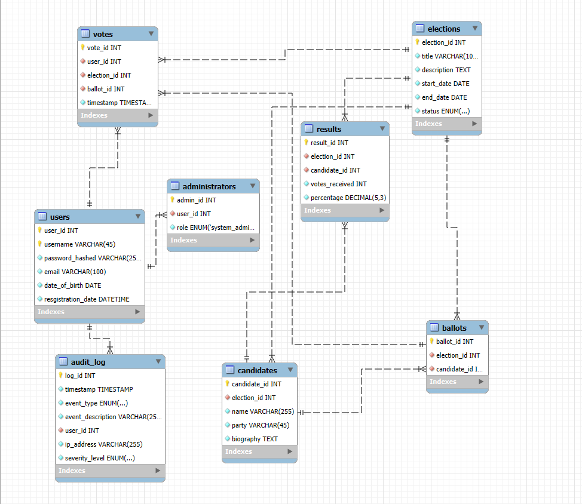

Online Voting System

## INTRODUCTION

In an age where technology seamlessly integrates into our daily lives, the way we participate in democracy is evolving. The Online Voting System is designed to empower citizens, making the voting process more accessible, secure, and efficient. Imagine a world where casting your vote is as simple as clicking a button from the comfort of your home, while still ensuring the integrity and confidentiality of your choices.

This serves as a comprehensive guide to our Online Voting System, detailing its features, functionalities, and the underlying technology that makes it all possible. Our goal is to break down barriers to participation, ensuring that every eligible voter can easily engage in the democratic process, regardless of their location or circumstances.

As we navigate through the complexities of this system, we invite you to explore the thoughtful design and robust security measures that have been put in place. From user-friendly interfaces to advanced encryption protocols, every aspect of the Online Voting System has been crafted with the voter in mind. Together, we can enhance civic engagement and foster a more inclusive democratic process for all.

## Project Features and Characteristics

<!-- Goes here... -->

## Project Scope

The Online Voting System project aims to bring modern technology, ensuring that voting is secure and efficient for all eligible voters. Emphasizing the need for scalability, security, and performance optimization, the integration of diverse technologies and protocols must be orchestrated with precision to create a robust and user-friendly online voting platform.
The Online Voting System project aims to bring modern technology, ensuring that voting is secure and efficient for all eligible voters. Emphasizing the need for scalability, security, and performance optimization, the integration of diverse technologies and protocols must be orchestrated with precision to create a robust and user-friendly online voting platform.

The online voting system's architecture must be enough to handle high volumes of traffic during peak periods, ensuring that each vote is accurately recorded and securely stored. Stakeholders can ensure maximum voter participation, while also safeguarding the integrity and confidentiality of the voting process. This entails the meticulous planning and implementation of data encryption, authentication mechanisms, and failover systems to prevent any potential disruptions or security breaches. By adhering to best practices in system integration and architecture, the online voting system can significantly enhance the democratic process by providing a convenient, accessible, and transparent platform for citizens to exercise their right to vote.

## Work breakdown Structure

## Functional Requirements

### User Requirements

### Use case

### Database Architecture

### Data Dictionary

# Database Tables

## This is not yet final.

## Table 1: `administrators`

| Column Name            | Data Type              | Constraints                                                                      |
| ---------------------- | ---------------------- | -------------------------------------------------------------------------------- |
| `admin_id`             | `int`                  | `NOT NULL`, `AUTO_INCREMENT`, `PRIMARY KEY`                                      |
| `user_id`              | `int`                  | `NOT NULL`, `KEY fk_user_id_admin_idx`, `FOREIGN KEY`                            |
| `role`                 | `enum('system_admin')` | `NOT NULL`                                                                       |
| **Indexes**            | **Description**        |                                                                                  |
| `PRIMARY`              | (`admin_id`)           |                                                                                  |
| `fk_user_id_admin_idx` | (`user_id`)            | `FOREIGN KEY` REFERENCES `users` (`user_id`) ON DELETE CASCADE ON UPDATE CASCADE |

## Table 2: `audit_log`

| Column Name         | Data Type                                                              | Constraints                                                    |
| ------------------- | ---------------------------------------------------------------------- | -------------------------------------------------------------- |
| `log_id`            | `int`                                                                  | `NOT NULL`, `AUTO_INCREMENT`, `PRIMARY KEY`                    |
| `timestamp`         | `timestamp`                                                            | `NOT NULL`, `DEFAULT CURRENT_TIMESTAMP`                        |
| `event_type`        | `enum('USER_LOGIN','VOTE_CAST','ELECTION_CREATED','SETTINGS_CHANGED')` | `NOT NULL`                                                     |
| `event_description` | `varchar(255)`                                                         | `NOT NULL`                                                     |
| `user_id`           | `int`                                                                  | `NOT NULL`, `KEY fk_user_id_idx`, `FOREIGN KEY`                |
| `ip_address`        | `varchar(255)`                                                         | `NOT NULL`                                                     |
| `severity_level`    | `enum('INFO','WARNING','CRITICAL')`                                    | `NOT NULL`                                                     |
| **Indexes**         | **Description**                                                        |                                                                |
| `PRIMARY`           | (`log_id`)                                                             |                                                                |
| `fk_user_id_idx`    | (`user_id`)                                                            | `FOREIGN KEY` REFERENCES `users` (`user_id`) ON UPDATE CASCADE |

## Table 3: `ballots`

| Column Name                  | Data Type        | Constraints                                                                                |
| ---------------------------- | ---------------- | ------------------------------------------------------------------------------------------ |
| `ballot_id`                  | `int`            | `NOT NULL`, `AUTO_INCREMENT`, `PRIMARY KEY`                                                |
| `election_id`                | `int`            | `NOT NULL`, `KEY fk_election_id_ballot_idx`, `FOREIGN KEY`                                 |
| `candidate_id`               | `int`            | `NOT NULL`, `KEY fk_candidate_id_ballot_idx`, `FOREIGN KEY`                                |
| **Indexes**                  | **Description**  |                                                                                            |
| `PRIMARY`                    | (`ballot_id`)    |                                                                                            |
| `fk_election_id_ballot_idx`  | (`election_id`)  | `FOREIGN KEY` REFERENCES `elections` (`election_id`) ON DELETE CASCADE ON UPDATE CASCADE   |
| `fk_candidate_id_ballot_idx` | (`candidate_id`) | `FOREIGN KEY` REFERENCES `candidates` (`candidate_id`) ON DELETE CASCADE ON UPDATE CASCADE |

## Table 4: `candidates`

| Column Name          | Data Type        | Constraints                                                                              |
| -------------------- | ---------------- | ---------------------------------------------------------------------------------------- |
| `candidate_id`       | `int`            | `NOT NULL`, `AUTO_INCREMENT`, `PRIMARY KEY`                                              |
| `election_id`        | `int`            | `NOT NULL`, `KEY fk_election_id_idx`, `FOREIGN KEY`                                      |
| `name`               | `varchar(255)`   | `NOT NULL`                                                                               |
| `party`              | `varchar(45)`    | `NOT NULL`                                                                               |
| `biography`          | `text`           | `NOT NULL`                                                                               |
| **Indexes**          | **Description**  |                                                                                          |
| `PRIMARY`            | (`candidate_id`) |                                                                                          |
| `fk_election_id_idx` | (`election_id`)  | `FOREIGN KEY` REFERENCES `elections` (`election_id`) ON DELETE CASCADE ON UPDATE CASCADE |

## Table 5: `elections`

| Column Name   | Data Type                                | Constraints                                 |
| ------------- | ---------------------------------------- | ------------------------------------------- |
| `election_id` | `int`                                    | `NOT NULL`, `AUTO_INCREMENT`, `PRIMARY KEY` |
| `title`       | `varchar(100)`                           | `NOT NULL`                                  |
| `description` | `text`                                   | `NOT NULL`                                  |
| `start_date`  | `date`                                   | `NOT NULL`                                  |
| `end_date`    | `date`                                   | `NOT NULL`                                  |
| `status`      | `enum('upcoming','ongoing','completed')` | `NOT NULL`                                  |
| **Indexes**   | **Description**                          |                                             |
| `PRIMARY`     | (`election_id`)                          |                                             |

## Table 6: `results`

| Column Name                  | Data Type        | Constraints                                                                                |
| ---------------------------- | ---------------- | ------------------------------------------------------------------------------------------ |
| `result_id`                  | `int`            | `NOT NULL`, `AUTO_INCREMENT`, `PRIMARY KEY`                                                |
| `election_id`                | `int`            | `NOT NULL`, `KEY fk_election_id_results_idx`, `FOREIGN KEY`                                |
| `candidate_id`               | `int`            | `NOT NULL`, `KEY fk_candidate_id_idx`, `FOREIGN KEY`                                       |
| `votes_received`             | `int`            | `NOT NULL`                                                                                 |
| `percentage`                 | `decimal(5,3)`   | `NOT NULL`                                                                                 |
| **Indexes**                  | **Description**  |                                                                                            |
| `PRIMARY`                    | (`result_id`)    |                                                                                            |
| `fk_election_id_results_idx` | (`election_id`)  | `FOREIGN KEY` REFERENCES `elections` (`election_id`) ON DELETE CASCADE ON UPDATE CASCADE   |
| `fk_candidate_id_idx`        | (`candidate_id`) | `FOREIGN KEY` REFERENCES `candidates` (`candidate_id`) ON DELETE CASCADE ON UPDATE CASCADE |

## Table 7: `users`

| Column Name          | Data Type               | Constraints                                 |
| -------------------- | ----------------------- | ------------------------------------------- |
| `user_id`            | `int`                   | `NOT NULL`, `AUTO_INCREMENT`, `PRIMARY KEY` |
| `username`           | `varchar(45)`           | `NOT NULL`, `PRIMARY KEY`                   |
| `password_hashed`    | `varchar(255)`          | `NOT NULL`                                  |
| `email`              | `varchar(100)`          | `NOT NULL`                                  |
| `date_of_birth`      | `date`                  | `NOT NULL`                                  |
| `resgistration_date` | `datetime`              | `NOT NULL`, `DEFAULT CURRENT_TIMESTAMP`     |
| **Indexes**          | **Description**         |                                             |
| `PRIMARY`            | (`user_id`, `username`) |                                             |

## Table 8: `votes`

| Column Name            | Data Type       | Constraints                                                                              |
| ---------------------- | --------------- | ---------------------------------------------------------------------------------------- |
| `vote_id`              | `int`           | `NOT NULL`, `AUTO_INCREMENT`, `PRIMARY KEY`                                              |
| `user_id`              | `int`           | `NOT NULL`, `KEY fk_user_id_votes_idx`, `FOREIGN KEY`                                    |
| `election_id`          | `int`           | `NOT NULL`, `KEY fk_election_id_idx`, `FOREIGN KEY`                                      |
| `ballot_id`            | `int`           | `NOT NULL`, `KEY fk_ballot_id_idx`, `FOREIGN KEY`                                        |
| `timestamp`            | `timestamp`     | `NOT NULL`, `DEFAULT CURRENT_TIMESTAMP`                                                  |
| **Indexes**            | **Description** |                                                                                          |
| `PRIMARY`              | (`vote_id`)     |                                                                                          |
| `fk_user_id_votes_idx` | (`user_id`)     | `FOREIGN KEY` REFERENCES `users` (`user_id`) ON DELETE CASCADE ON UPDATE CASCADE         |
| `fk_election_id_idx`   | (`election_id`) | `FOREIGN KEY` REFERENCES `elections` (`election_id`) ON DELETE CASCADE ON UPDATE CASCADE |
| `fk_ballot_id_idx`     | (`ballot_id`)   | `FOREIGN KEY` REFERENCES `ballots` (`ballot_id`) ON DELETE CASCADE ON UPDATE CASCADE     |

# Legend

1. **`administrators`**: Table 1
2. **`audit_log`**: Table 2
3. **`ballots`**: Table 3
4. **`candidates`**: Table 4
5. **`elections`**: Table 5
6. **`results`**: Table 6
7. **`users`**: Table 7
8. **`votes`**: Table 8

## ERD

## Non Functional Requirements

### Functional Testing Summary

### Evaluation Procedure

### Recommendation
